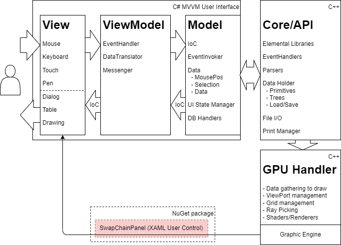

<!--This markdown is edited with VSCode and Markdown Preview Enhanced plugin-->
# A sample project of a C++/WinRT XAML object to make C#/.Net projection

A sample project to make UserControl (based on SwapChainPanel in C++/WinRT) and projection project for .Net.
This repository was made to "Ask Question" in [Microsoft Q&A](https://learn.microsoft.com/en-us/answers/questions/992490/how-to-make-projection-usercontrol-xaml-resource-i.html) but I also want help from other persons. The code shows SwapChainPanel on local NuGet package in C++/WinRT on C# WinUI3 xaml code. Now I'm investigating how to interop with DirectX. I don't know wether it can be achieved through NuGet system. For debug, it seems harder.

The most of the code comes from _"original code"_ on Reference "SimpleMath" by Microsoft.

## Motivation

I'm now building a WindowsAppSDK(WinUI3) based C#/.Net desktop application. (most probably I will use C#/WinRT.)
Now the era of Modern UI. Windows App SDK gave us new way to make desktop application using WinUI3 in XAML. 
So I thought that I can get performance in C++ and get productivity in C#. Especially around DirectX, the SwapChainPanel was re-defined in Microsoft.UI.XAML.Controls namespace. This means, Microsoft let us use the SwapChainPanel driven by DirectX with C++/WinRT, and in other parts make us use C#. Interop of C#/WinRT and C++/WinRT using WindowsAppSDK make it possible... 

Fig.1 a rough sketch of C#-based C++/WinRT graphic program

 
But it seems a harder way than I thought. Every tutorials in Microsoft Docs avoid this case. In old days, in UWP articles, there are some ways to make tool panels in XAML. Now, the .Net 6 restrict to use "project reference". It means that I have to make it in NuGet package. Are there good way to debug C# and C++'s *.nuget package interactively? The nuget package should not be just a gathering of APIs. It needs states, memory and processes. Is the architecture possible?

With "project reference", I have a UWP sample. What I want is WinUI3 desktop.
  
## Status
In 30/12/2022, JunjieZhu-MSFT-san gave us the workaround to show the content of SwapChainPanel in nuget package. It requires Generic.xbf, a compiled generic.xaml. So I put it according to the advise.
Then now I'll restart investivgate the possibility to DirectX (in C++) interoperability without any wrappers. I still don't know this possible or not. 
  

## The Source Code

The repository includes;

- One Windows Runtime Component and Projecting project, _CppWinRTComponentProjectionSample_.
- One stub project named _StubWinUI3Desktop_ to use it. Though another solution _ConsoleAppSample_ existed but is obsolete.

Currently, the default SwapChainPanel has only TextBox, no draw, no shader.
  1) Open solution file "CppWinRTComponentProjectionSample.sln" and restore packages then make it Release/AnyCPU.
      it should provide "....\NetProjection\SimpleMathProjection\nuget\SimpleMathComponent.x.y.z-prerelease.nupkg" where 'x.y.z' is what you specified in "SimpleMathProjection.nuspec" as version number.
  2) Then open solution file "StubWinUI3Desktop.sln" and restore packages then make it Relase or Debug as x64 application. Be sure you're referring the ratest build nupkg. I recommend you to update version number in *.nuspec on every build. 
 
Soon or later, I'll unify these solutions.

## Reproducing Error
updated: 1/5/2023

There seems no errors at this moment. The border color/width on SwapChainPanel seems meanless as specifiication.
  
updated: 9/27/2022

Windows SDK 10.0.22621.0 and 10.0.19040.0(as minimum).
with VisualStudio 2022;

Confirm, this modification was done in _develop_ branch only.

I remove _SimpleMath.idl_ and related modules. Though it was in the same namespace of _BoxRenderer.idl_, when I unified them, the compiler output a multiple declaration error. So I decided to remove _SimpleMath.idl_ and its staff. And to simplify, I removed property from _BoxRenderer.idl_ also. Now the code "ConsoleAppSample.sln" does not work. Then its solution files were removed.
 Before starting, confirm you're in _develop_ branch. This is experimental branch.

1) delete "_your_home_\\.nuget\packages\simplemathcomponent\A.B.C-prerelease\\" folders, if exists. (_A.B.C_ is version number.)
2) Open _CppWinRTComponentProjectionSample.sln_
3) Restore NuGet packages.
4) Set Release/x64 (optionally, Debug can be build but not referred.)
5) build solution. If "SimpleMathProjection/nuget/SimpleMathComponent.A.B.C-prerelease.nupkg" generated, close the solution. 
The control "**BoxRenderer**" is included in it. This is a user control derived from SwapChainPanel.
1) Open _StubWinUI3Desktop.sln_ and restore NuGet packages. Make sure the project include "_SimpleMathComponent.A.B.C-prerelease.nupkg_" got in 5.
2) set release/x64 or Debug/x64 then build.
3) Run it and push "Next Page" button. Now it works without errors but seems no SwapChainPanel appeared. Is it?

## What doesn't work

- cannot display *BoxRenderer* XAML custom control which is just contain *SwapChainPanel* in WindowsRuntimeComponent which is written in C++/WinRT. There are no runtime error. If Height and Width properties are specified in the reference in DxPage.xaml of StubWinUI3Desktop, there appears a blank object (can confirm it looking the position of button goes left). So, refers something but does not show contents. All default value seems neglected.(?)

## Update

- Jan. 5/2023
  - Adopt 
  - Updated NuGet packages to the ratest (but not preview).
- 9/27/2022
  - Update some NuGet packages to the latest stables and confirm it doesn't harm.
  - Add "Themes\Generic.xaml" in *.nupec of projection project to add it to "Lib" in output. but no luck.
- 9/23/2022
  In develop branch;
  
  - delete SimpleMath part from "_CppWinRTComponentProjectionSample.sln_". Now it has only one *.idl, "BoxRenderer". It just a SwapChainPanel. (the name 'SimpleMath' has no longer any meaning.)
  - properties are removed from BoxRenderer.
  - the Ci7 branch was deleted.

- 09/21/2022 reduce parameters and properties from the experimental source Ci7 branch.

- 09/14/2022
  
  - Fix reference bug on _StubWinUI3Desktop.sln_.
  - Change property from _BackColor_ to _BoxSize_. Because WinUI3's SwapChainPane does not have the BackColor property then define an independent property (not used, currently).
  - CsWinRT was added/updated to required projects.
    _StubWinUI3Desktop_ has a normal SwapChainPanel at the first page to compare WRC's SwapChainPanel-based user control.

- 09/09/2022
  
  - I realize that the SwapChainPanel does not appear to the consuming app
  - Add normal SwapChainPanel (in WinUI3) page to compare propagated from NuGet package (in C++/WinRT). and realized that SwapChainPaned. Though I've once put DirectX resource on it but delete again.

- 09/06/2022
  
  - by JunjieZhu-MSFT's comment, the compile errors were disappeared. (Thanks!)

- 09/05/2022
  
  - SwapChainPanel placed in XAML in Generic.xaml directly (but it did not work).
  - Property changed to represents background color (but it does not work).

## Reference

- [original code](https://github.com/microsoft/CsWinRT/tree/master/src/Samples/NetProjectionSample)
- [Generate a C# projection from a C++/WinRT component, distribute as a NuGet for .NET apps](https://docs.microsoft.com/en-us/windows/apps/develop/platform/csharp-winrt/net-projection-from-cppwinrt-component)
- [Windows Runtime components with C++/WinRT](https://docs.microsoft.com/en-us/windows/uwp/winrt-components/create-a-windows-runtime-component-in-cppwinrt)
- [Build XAML controls with C++/WinRT](https://docs.microsoft.com/en-us/windows/apps/winui/winui3/xaml-templated-controls-cppwinrt-winui-3)
- [Call Windows Runtime APIs in desktop apps](https://docs.microsoft.com/en-us/windows/apps/desktop/modernize/desktop-to-uwp-enhance)

## About the repository

- To change main requires pull request.
- develop branch can be modified freely.
- If there are another branch, that's a experimental. Do not use, basically.
